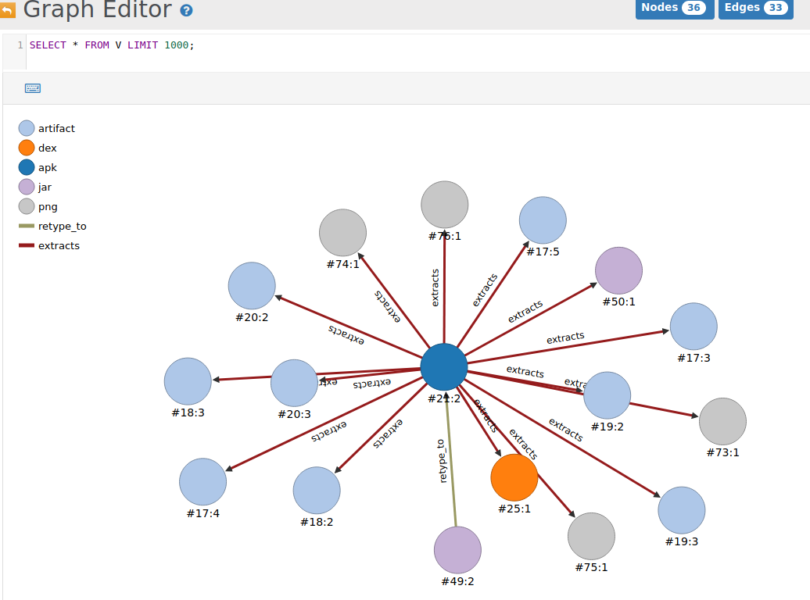
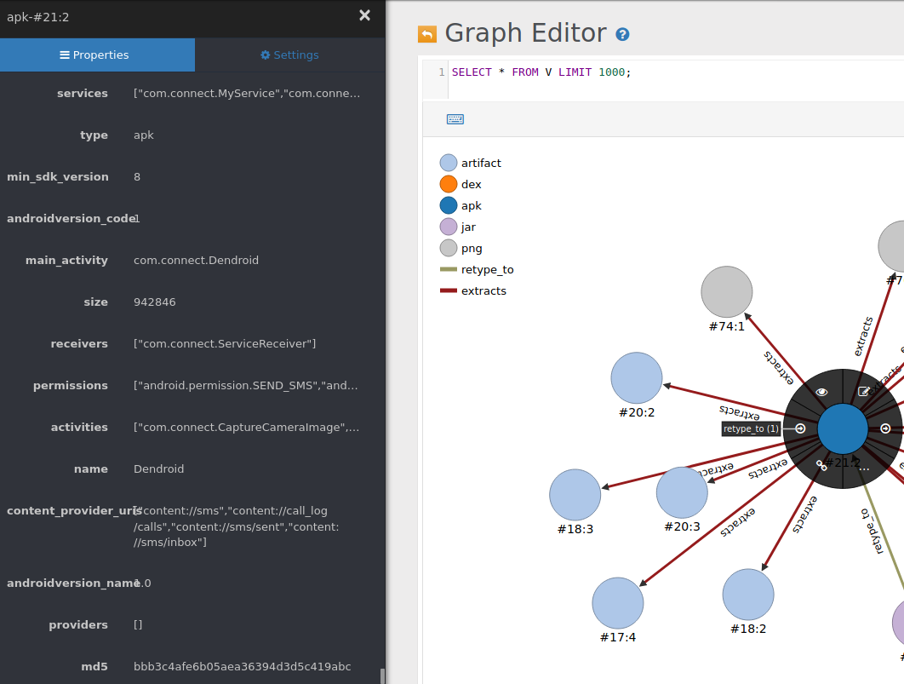

# Machina

Machina is a scalable and modular binary analysis pipeline.  Machina's design is inspired by a couple existing frameworks and seeks to bring the best of their features into one: [FAME](https://github.com/certsocietegenerale/fame) and [Viper](https://github.com/viper-framework/viper)

Key features:

* data-type discovery workflow
* modular worker development (containerized)
* recursive analysis of extract artifacts
* graph storage backend, allowing artifacts to be linked
    - 'what' (artifacts) as nodes
    - 'why' (relationship) as edges


Machina uses RabbitMQ as a queueing system to support binary submission and scalable analyses.  Each Machina Worker Module gets its own queue, which is bound to one or many routing keys associated with an abstract file type (e.g. an apk, pe, elf, etc..).  This allows for a Worker Module to handle any or all supported abstract file types.  When data is submitted to the pipeline (directly to the Identifier queue), the Identifier deteremines its type and publishes a message with the type as the routing key.  This message is consumed by all Worker Modules that are configured to support that type.  

To assign an abstract type to data submitted to the pipeline, the Identifier Worker Module attempts to discover the type of data submitted (e.g. mime-type, magic header, or manual assertion).  A couple of examples of analyses visualized in the backend's (OrientDB) graph editor:

## Administration

* OrientDB GUI: http://127.0.0.1:2480
  - username: root, password: root

Recursive APK Analysis:


Node selection enables detailed analysis data:


## Use-case

* Capture-the-flag 
* Binary analysis
* PCAP analysis
* Inter-artifact relationship discovery
* Defeat common steganography

## Client installation

It is recommended to set up and use a Python 3 virtual environment to isolate dependency installation. Install [virtualenv](https://python-guide-cn.readthedocs.io/en/latest/dev/virtualenvs.html).

Create a virtual environment:

```
virtualenv -p python3 machina-cli
source machina-cli/bin/activate
```

Install the client:

```
cd cli
python setup.py install
```

## Services installation

* [Install Docker](https://docs.docker.com/install/linux/docker-ce/ubuntu/)

### Production Setup

Section is WIP

#### Clone

```bash
git clone git@github.com:ehrenb/machina.git
```

#### Pull

* This will pull the latest pre-built Machina images

```bash
docker compose pull
```

### Development Setup

#### Clone:

```bash
git clone --recurse-submodules git@github.com:ehrenb/machina.git &&\
  cd machina &&\
  git submodule foreach git checkout main &&\
  git submodule foreach git pull
```

#### Build:

* This will build Machina and all of its analysis services from the local source

```bash
docker compose build base-alpine base-ubuntu && docker compose build
```

## Run and daemonize services


```bash
docker compose up -d
```


Scaling additional workers:

```bash
docker compose scale identifier=2 androguardanalysis=5
```

## Use client

```
./bin/machina.py --help
./bin/machina.py submit <filepath>
```

Optionally, you can publish your own message to the RabbitMQ Server, with the routing key set to 'Identifier' and a JSON body like the following:

```json
{"data":  "<b64encoded_data>"}
```

Or, to assert a type (must be available in the 'available_types' configuration within types.json), forcing the Identifier to skip type resolution and accept your own:

```json
{
  "data": "<64encoded_data>",
  "type": "apk"
}
```

## Cleanup

Delete the database (WARNING: this will delete all of your data!)

```bash
docker volume rm machina_orientdb-data
```


## Module development

Read over the [Module Development](images/README.md) guide and some of the various [module sources](images/).